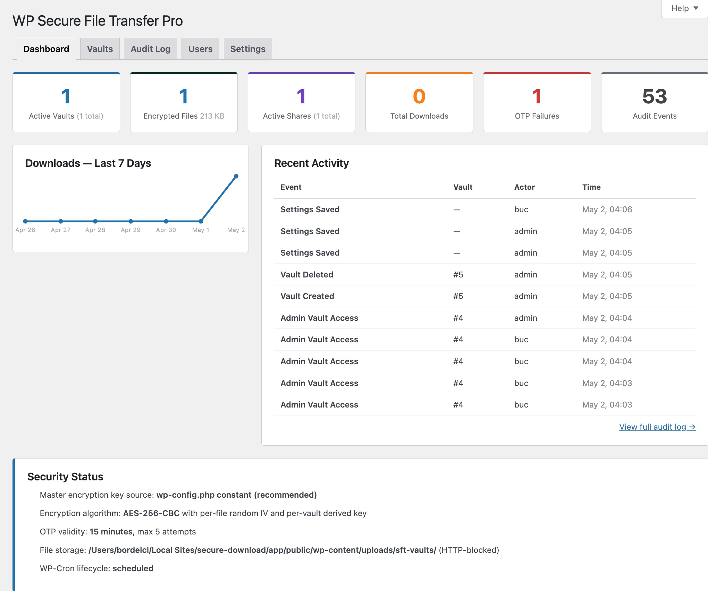
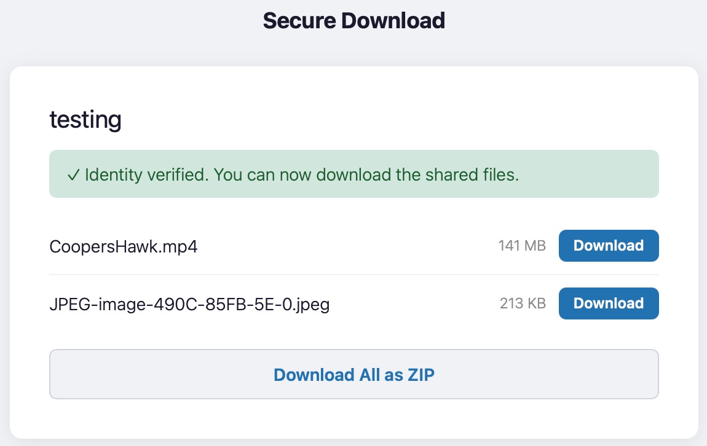
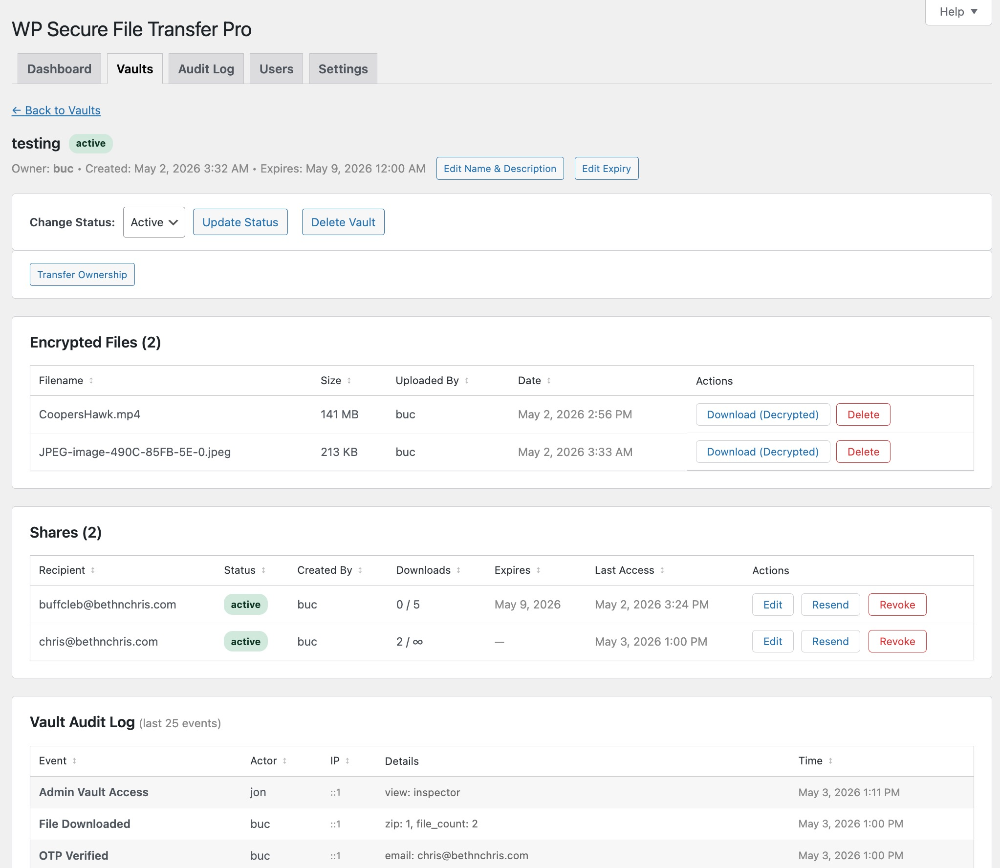

# WP Secure File Transfer Pro

**Version:** 1.2.0  
**Requires WordPress:** 5.3+  
**Requires PHP:** 7.4+  
**License:** GPL-3.0-or-later

Encrypted file vaults with two-factor external sharing, comprehensive audit logging, lifecycle management, and role-based vault oversight.

---

## What It Does

WP Secure File Transfer Pro lets authenticated WordPress users upload files into named **vaults**, where they are encrypted at rest using AES-256-CBC before being written to disk outside the webroot. Vault contents can be shared securely with external, unauthenticated recipients through a two-factor verification flow: invite email → email confirmation → one-time code. Every action across the plugin is recorded in an immutable audit log.



---

## Features at a Glance

| Feature | Description |
|---|---|
| **Encrypted vault storage** | AES-256-CBC with a unique per-vault key derived from a site-wide master key. Files stored outside the webroot. |
| **Two-factor external sharing** | Recipients receive an invite link, confirm their email, then verify a time-limited one-time code before downloading. |
| **Multi-file upload** | Upload multiple files in one go. Files queue and upload sequentially through the chunked system with per-file progress rows. |
| **ZIP bulk download** | Recipients can download all vault files as a single ZIP archive. Requires PHP `ZipArchive`; button hidden automatically when unavailable. |
| **Chunked file upload** | Files split client-side and reassembled server-side — bypasses PHP `upload_max_filesize` and `post_max_size` limits. |
| **File type restrictions** | Comma-separated extension allowlist blocks disallowed uploads server-side at the chunk-finalize step. |
| **Per-user storage quotas** | Set a per-user MB ceiling enforced at upload time. Administrators are exempt. |
| **Role-based access** | Two tiers of non-admin access: **SFT Admin** (full panel) and **Vault User** (My Vaults only). |
| **Sortable tables** | All tabular data supports clickable column sorting — server-side for paginated lists, client-side for inspector sub-tables. |
| **WordPress dashboard widgets** | Admin vault overview widget and personal My Vaults widget on the wp-admin home screen. |
| **Global share limits** | Configure default and maximum download counts and link expiration windows. Retroactively enforce on existing shares. |
| **OTP rate limiting** | Configurable cooldown between OTP requests prevents automated code-request flooding. |
| **Lifecycle management** | Hourly WP-Cron expires vaults and shares, sends expiry warnings, prunes stale OTPs, cleans orphaned chunks, and optionally auto-prunes audit entries. |
| **Download notifications** | Vault owners receive an email each time a recipient downloads a file (configurable). |
| **Share expiry warnings** | Vault owners are emailed a configurable number of days before each share link expires. Each share is warned once. |
| **Email templates** | Customize subject and body for all four system emails (Share Invite, OTP, Download Notification, Expiry Warning) with `{placeholder}` tokens. |
| **Immutable audit log** | Every vault, file, share, OTP, and settings event logged with actor, IP, and timestamp. Filterable, sortable, exportable to CSV. |
| **Super-admin vault inspector** | Browse every vault; download (including ZIP), edit name/description, transfer ownership, change status, revoke shares, delete vaults. |
| **SIEM logging** | Append every audit event to an OS log file in JSON (NDJSON) or CSV format for Splunk, Datadog, ELK, and similar tools. |
| **Encryption key generator** | Server-side CSPRNG key generation with a copy-to-clipboard modal for placing the key in `wp-config.php`. |
| **Contextual help** | WordPress contextual help tabs on every admin panel tab and the user dashboard. |

---

## Requirements

| Requirement | Minimum |
|---|---|
| WordPress | 5.3 |
| PHP | 7.4 |
| PHP extensions | `openssl`, `mbstring` |
| PHP extensions (optional) | `zip` — required for ZIP bulk download |
| MySQL / MariaDB | 5.6 / 10.0 |

---

## Documentation

Detailed documentation is in the [`docs/`](docs/) directory:

| Guide | Description |
|---|---|
| [Installation](docs/installation.md) | Requirements, setup checklist, upgrade notes |
| [Configuration](docs/configuration.md) | All settings explained with defaults and ranges |
| [User Guide](docs/user-guide.md) | Creating vaults, uploading files, sharing, revoking |
| [Admin Guide](docs/admin-guide.md) | Dashboard, vault inspector, audit log, user management |
| [Security Reference](docs/security.md) | Cryptographic design, security controls, known limitations |
| [Architecture](docs/architecture.md) | File structure, DB schema, encryption flow, key functions |

---

## Quick Start

1. Upload `wp-secure-file-transfer-pro/` to `/wp-content/plugins/` and activate.
2. Go to **Secure Transfer → Settings** and generate a master encryption key.
3. Copy the key into `wp-config.php` as `define('SFT_MASTER_KEY', '...');`.
4. Confirm **Dashboard → Security Status** shows all green.
5. Go to **Secure Transfer → Users** to grant vault access to non-admin users.


---

## Encryption Key

The master key is the root secret from which every vault's unique encryption key is derived via HMAC-SHA256. It must be a 64-character hexadecimal string (32 raw bytes).

**Recommended — `wp-config.php`:**

```php
define( 'SFT_MASTER_KEY', 'your-64-hex-character-key-here' );
```

Place this line before the `/* That's all, stop editing! */` comment. When the constant is defined, the key is never stored in the database.

**Fallback — database:** If the constant is not defined, the plugin auto-generates a key on first use and stores it in `wp_options`. The Settings tab shows an advisory to move it to `wp-config.php`.

> **Warning:** Replacing an existing master key permanently breaks decryption of all previously uploaded files. Only generate a new key on a fresh installation with no uploaded files.

---

## Access Roles

| Role | Capability | Access |
|---|---|---|
| WordPress Admin | `manage_options` | Full access — always implicit |
| **SFT Admin** | `sft_admin` | Full Secure Transfer admin panel — all tabs, vault inspector, audit export, settings, Users tab |
| **Vault User** | `use_sft_vaults` | My Vaults only — create, upload, share, revoke |

WordPress administrators are always exempt from share limits and expiration restrictions. Grant and manage access at **Secure Transfer → Users**.


---

## Two-Factor Share Flow

1. Vault owner creates a share → unique URL token generated → invite email sent.
2. Recipient opens share URL → enters their email address.
3. `sft_send_otp()` validates the email matches the invite, generates a 6-digit OTP (via `random_int`), hashes it with `wp_hash_password`, and emails the plaintext code.
4. Recipient submits the OTP → `sft_verify_otp_for_share()` checks the hash, enforces the attempt limit, marks the OTP used.
5. A 32-byte download session token is issued as a WordPress transient (30-minute TTL).
6. Each file download validates the session token and share accessibility before decrypting and streaming.




---

## Admin Panel

Accessible at **Secure Transfer** (requires `manage_options` or `sft_admin` capability).

| Tab | Description |
|---|---|
| Dashboard | Real-time stats, 7-day download sparkline, recent activity, security status |
| Vaults | Browse all vaults; filter by status/name; inspect files, shares, and audit trail per vault; edit name/description, expiry, and shares inline; transfer ownership; ZIP download; sortable columns |
| Audit Log | Filterable, sortable, paginated event log; CSV export; manual prune; all timestamps in site timezone |
| Users | Manage SFT Admins and Vault Users; grant, promote, demote, revoke; user search |
| Settings | All plugin configuration; OTP cooldown; notifications; file type restrictions; storage quotas; email templates; encryption key; SIEM logging |


---

## User Dashboard

Users with vault access manage their own vaults under **My Vaults** in wp-admin.

- **Create a vault** — name, optional description, optional expiry date.
- **Edit vault name/description** — rename or update description inline at any time.
- **Upload files** — multi-file chunked upload with per-file progress rows; files encrypted before storage.
- **Share a vault** — enter recipient email, optional download limit, optional expiry; recipient completes two-factor verification.
- **Edit a share** — update download limit or expiry date on an existing share without revoking it.
- **Revoke a share** — removes access immediately.
- **Activity log** — last 20 events per vault, sortable.

The `[sft_my_vaults]` shortcode renders equivalent functionality on any front-end page.



---

## WordPress Dashboard Widgets

Two widgets appear on the wp-admin home screen:

**Admin vault overview** (SFT Admins only):
- Total and active vault counts, file count, total encrypted storage size
- Active share count, downloads (7 days), OTP failures (30 days — highlighted red if > 0)
- Link to the admin panel

**My Vaults** (Vault Users):
- Personal vault count, active vault count, file count, active share count
- Last 5 activity events
- Link to My Vaults


---

## Architecture

### File Storage

Encrypted files are written to `wp-content/uploads/sft-vaults/{vault_id}/{random}.enc`. The root is protected by `.htaccess` (`Deny from all`). Files are never served directly — all downloads go through PHP, which decrypts on the fly.

Chunked upload staging files live in `wp-content/uploads/sft-chunks/` and are cleaned up by the hourly cron.

### Encryption

- **Algorithm:** AES-256-CBC via PHP `openssl_encrypt`
- **Master key:** 32 bytes (64 hex chars), constant or `wp_options`
- **Vault key:** `HMAC-SHA256(vault_salt, master_key)` — unique per vault
- **IV:** 16 random bytes per file, stored as hex in the database
- **Streaming:** 1 MB chunks to avoid PHP memory limits on large files

### Database Tables

| Table | Purpose |
|---|---|
| `{prefix}sft_vaults` | Vault records — owner, status, salt, expiry |
| `{prefix}sft_files` | File metadata — original name, stored name, IV, size, MIME |
| `{prefix}sft_shares` | Share links — recipient, token, download count, expiry |
| `{prefix}sft_otps` | OTP records — hash, attempt count, expiry |
| `{prefix}sft_audit` | Immutable event log |

---

## Configuration Summary

All settings at **Secure Transfer → Settings**. See [Configuration](docs/configuration.md) for full details.

| Section | Key Settings |
|---|---|
| Two-Factor Verification | OTP validity (5–60 min, default 15), max attempts (1–20, default 5), OTP cooldown (seconds) |
| Download Limits | Allow unlimited, default limit, maximum limit |
| Link Expiration | Allow no expiry, default days, maximum days |
| File Uploads | Maximum file size in MB (can exceed server's `upload_max_filesize`) |
| Notifications | Download notification emails, share expiry warning lead time (days) |
| File Type Restrictions | Comma-separated extension allowlist (blank = allow all) |
| Storage Quotas | Per-user storage ceiling in MB (0 = no limit) |
| Email Templates | Customize subject and body for Share Invite, OTP, Download Notification, Expiry Warning |
| SIEM Logging | Enable, absolute log path, format (JSON / CSV) |
| Audit Log Retention | Auto-prune on/off, retention window in days |
| Data & Privacy | Delete all data on uninstall |

---

## Uninstall

Enable **Delete all plugin data on uninstall** in Settings before removing the plugin if you want all data removed. Deletion permanently drops all five database tables, deletes all encrypted files from disk, and removes all plugin options and transients. **This is irreversible.** Leave the setting disabled to preserve data across a reinstall.

---

## Changelog

### 1.2.0
- **Multi-file upload** — file inputs now accept `multiple` files. Files upload sequentially through the existing chunked system with per-file progress rows. Available in both the admin vault inspector and the `[sft_my_vaults]` shortcode.
- **ZIP bulk download** — recipients with a valid download session see a **Download All as ZIP** button when a vault has more than one file. All vault files are decrypted server-side and streamed as a single archive. Requires the PHP `ZipArchive` extension; the button is hidden automatically when unavailable.
- **Download notification** — when enabled (Settings → Notifications), an email is sent to the vault owner each time a recipient downloads a file via a share link.
- **Share expiry warnings** — configure a lead time (days) in Settings. The lifecycle cron emails the vault owner before each share link expires; each share is warned only once (`expiry_warning_sent` flag).
- **Email templates** — customize subject and body for all four system emails (Share Invite, OTP Code, Download Notification, Expiry Warning) with `{placeholder}` tokens. Blank fields fall back to built-in defaults.
- **File type restrictions** — a comma-separated extension allowlist in Settings → File Type Restrictions blocks uploads of disallowed file types at the server-side chunk-finalize step.
- **Per-user storage quota** — set a per-user MB ceiling in Settings → Storage Quotas. Enforcement happens server-side at upload time; WordPress and SFT admins are exempt.
- **OTP rate limiting** — configurable cooldown (seconds) between OTP requests prevents recipients from requesting codes in rapid succession.
- **Vault transfer** — admins can transfer vault ownership to any user with vault access directly from the vault inspector.
- **DB version migration** — added `SFT_DB_VERSION` constant and `sft_maybe_upgrade_db()` for safe, idempotent schema updates via `dbDelta()` on `plugins_loaded`.

### 1.1.1
- **Resend share invite** — a **Resend** button on every pending or active share re-sends the original invite email to the recipient using the same share token and link. Available in both the admin vault inspector and the user vault detail page. The action is recorded in the audit log as `share_resent`.

### 1.1.0
- **Sortable tables** — clickable column sorting on all tabular data. Server-side URL-based sorting on paginated lists (vault list, audit log, My Vaults); client-side sorting on inspector and vault detail sub-tables and the Users tab. Active sort direction indicated with ↑/↓. Edit sub-rows stay pinned to their parent row during sort.
- **WordPress dashboard widgets** — admin vault overview widget (total/active vaults, file count, encrypted size, active shares, 7-day downloads, 30-day OTP failures) and personal My Vaults widget (vault/file/share counts, last 5 activity events) on the wp-admin home screen.
- **Contextual enforce checkboxes** — the standalone "Apply Limits to Existing Shares" card in Settings is replaced by per-section amber banners that appear only when the user modifies values in the Download Limits or Link Expiration section. Reverting changes hides the banner and unchecks the checkbox automatically.
- **Settings help tabs** — added dedicated contextual help sections for File Uploads, SIEM Logging, Audit Log Retention, Encryption Key, and Data & Privacy/Storage. Revised existing help sections to reflect current capabilities.
- **Help tab updates** — all admin panel and user dashboard contextual help tabs updated to reflect SFT Admin roles, sortable columns, dashboard widgets, and inline editing capabilities.
- **Security: SIEM path validation** — the SIEM log file path is now validated to be absolute and free of `..` traversal sequences before being stored. Invalid paths are rejected with a warning notice and the previous value is retained.
- **Security: Clipboard API** — the encryption key copy button uses `navigator.clipboard.writeText()` with a graceful fallback to `execCommand('copy')` for older browsers.
- **Documentation** — new `docs/` directory with six reference guides: Installation, Configuration, User Guide, Admin Guide, Security Reference, and Architecture.

### 1.0.2
- **SFT Admin user type** — new `sft_admin` capability grants non-WordPress-administrator users full access to the Secure Transfer admin panel. WordPress administrators continue to have full access implicitly. Promote, demote, and revoke from the redesigned Users tab.
- **Users tab redesign** — replaced WP role column with two sections: SFT Admins and Vault Users. Search panel shows current SFT status with contextual action buttons.
- **Timezone display** — all dates and times throughout the plugin (audit log, vault inspector, user dashboard, CSV export) now display in the site's configured timezone (Settings → General) rather than UTC.
- **SIEM logging** — write every audit event to an OS log file in JSON (NDJSON) or CSV format for ingestion by Splunk, Datadog, ELK, and other SIEM tools.
- **Admin vault expiry editing** — admins can edit a vault's expiry date inline from the vault inspector.
- **Admin share editing** — admins can edit a share's download limit and expiry date inline from the vault inspector.

### 1.0.1
- **Streaming encryption/decryption** — AES-256-CBC encrypt and decrypt now process files in 1 MB chunks, eliminating PHP memory exhaustion on large files (e.g. 2+ GB).
- **Chunked file upload** — large files split client-side and reassembled server-side via AJAX, bypassing `upload_max_filesize` and `post_max_size` PHP limits. Live progress bar in both admin and shortcode contexts.
- **Download limits and link expiration** — configure default and maximum download counts and expiry windows. Retroactively apply to existing shares.
- **Vault expiry editing** — vault owners can edit or clear a vault's expiry date after creation.
- **Share editing** — pending and active shares can have their download limit and expiry date updated inline without revoking and recreating.
- **Date picker** — share and vault expiry fields use a `date` input (full calendar picker). Expiries applied at end-of-day (23:59:59 UTC).
- **OTP attempt limit setting** — maximum verification attempts now configurable (previously hard-coded at 5).
- **Encryption key generator** — server-side key generation with copy-to-clipboard modal.
- **Audit log details filter** — filter audit log by keyword against the details column.
- **Role-based access (Users tab)** — grant and revoke the `use_sft_vaults` capability per user from the admin panel.
- **Bug fix** — `sft_max_download_limit` and `sft_max_expiry_days` settings were incorrectly clamped to a minimum of 1, preventing the "no ceiling" (0) value from being stored.
- **Bug fix** — download limit ceiling no longer overrides a share explicitly set to unlimited when unlimited downloads are permitted.

### 1.0.0
- Initial release.
- AES-256-CBC encrypted vault storage with per-vault HMAC-SHA256 key derivation.
- Two-factor external sharing (invite link → email verification → one-time code).
- Immutable audit log with CSV export and optional auto-pruning.
- Super-admin vault inspector with file download, share revocation, and vault status management.
- WP-Cron lifecycle management for expired vaults, shares, OTPs, and orphaned upload chunks.

---

## License

This plugin is licensed under the [GNU General Public License v3.0](https://www.gnu.org/licenses/gpl-3.0.html) or later.
